# Cordova 歩数取得サンプル(Cordova Health Plugin)

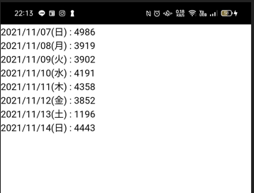

## 目的

* Cordova でGoogleFitから歩数を取得して表示します。
  * Google Fitの情報を取得するため`Google Cloud Platform コンソール`へ認証情報の登録が必要です

## 前提

* Cordova & React & TypeScript の[ビルド環境](https://qiita.com/murasuke/items/28e9bd4683426a8abc11)ができていること
* Andoroid
* Windows10

  Cordova & React & TypeScript の環境作成は[こちら](https://qiita.com/murasuke/items/28e9bd4683426a8abc11)を参照

  https://qiita.com/murasuke/items/28e9bd4683426a8abc11


## 作成したソース一式

  https://github.com/murasuke/cordova-react-health-starter

## 手順①(アプリ作成)
* ①[Cordova Health Plugin](https://github.com/dariosalvi78/cordova-plugin-health)のインストール

* ②`config.xml`に`<preference name="AndroidXEnabled" value="true" />`を追加

###  ①[Cordova Health Plugin](https://github.com/dariosalvi78/cordova-plugin-health)のインストール

### pluginを追加

歩数を取得するプラグインを導入します。


```
cordova plugin add cordova-plugin-health --variable HEALTH_READ_PERMISSION='App needs read access' --variable HEALTH_WRITE_PERMISSION='App needs write access'
```


* ②`config.xml`に`<preference name="AndroidXEnabled" value="true" />`を追加

ビルドで必要になるためです。


### 歩数を取得するためのソース

`App.tsx` 歩数を表示する&gt;StepList&lt;を表示します。

```tsx
import StepList from './StepList';

const App = () => {
  return (
    <div className="App">
        <StepList />
    </div>
  )
};

export default App;

```

`StepList.tsx` cordova-plugin-health を使い、直近１週間の歩数を取得して表示します。

```tsx
import React, { VFC, useEffect, useState } from 'react';

// GoogleFitから取得するデータ型
export type QueryData = {
  endDate: Date;
  startDate: Date;
  unit: string;
  value: number;
};

const StepList: VFC = () => {
  const [stepData, setStepData] = useState<QueryData[]>();
  const logErr = (err: any) => console.log(`${err}`);

  // 日付フォーマット(yyyy/MM/dd(ddd))
  const df = new Intl.DateTimeFormat('ja-JP', {
    year: 'numeric',
    month: '2-digit',
    day: '2-digit',
    weekday: 'short',
  });

  useEffect(() => {
    const health = (navigator as any).health;
    // GoogleFitが利用可能かどうか表示する
    health.isAvailable((available: boolean) => {
      if (available) {
        // Google Fitがインストールされていない場合、インストール用ダイアログを表示
        health.promptInstallFit(() => {
          // 歩数データのy見取りアクセスを要求
          health.requestAuthorization(
            [{ read: ['steps'] }],
            () => {
              // 期間とタイプ(歩数)を指定してデータを取得する
              health.queryAggregated(
                {
                  startDate: new Date(
                    new Date().getTime() - 7 * 24 * 60 * 60 * 1000,
                  ),
                  endDate: new Date(),
                  dataType: 'steps',
                  bucket: 'day',
                },
                (data: QueryData[]) => {
                  // 取得したデータをstateに保存(変更後、画面が再描画される)
                  setStepData(data);
                },
                logErr,
              );
            },
            logErr,
          );
        }, logErr);
      }
    }, logErr);
  }, []);

  // [日付 : 歩数] の形で画面に表示する
  return (
    <>
      <div>
        {stepData?.map((item) => (
          <div>{`${df.format(item.startDate)} : ${item.value}`}</div>
        ))}
      </div>
    </>
  );
};

export default StepList;
```


ビルド後に実機で実行しますが、権限チェックでエラーとなるため、`Google Cloud Platform コンソール`へアプリケーションの登録と、認証関連の設定を行います。

下部に記載した「<b>手順②(Google Cloud Platformへ認証情報の登録)</b>」を実施してください。

```
npm run build
cordova run android --target=<デバイスのID>
```

※デバイスのIDは下記で取得する。
```
$ cordova run --list
Available android devices:
b764afd4
Available android virtual devices:
Android_Accelerated_x86_Oreo
pixel_2_pie_9_0_-_api_28
Available browser devices:
```

* 認証情報の登録後、アプリケーションを起動すると下記のダイアログが表示されます。
全て許可を行うことで、歩数が取得できるようになります。


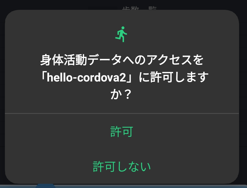

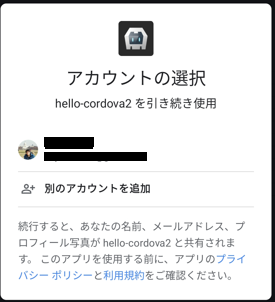

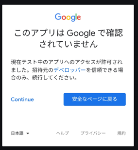

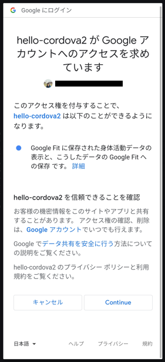

全て許可すると、画面に歩数が表示されます。


----

## 手順②(Google Cloud Platformへ認証情報の登録)


### Google Cloud Platform コンソールでプロジェクトを作成する。

https://console.cloud.google.com/cloud-resource-manager

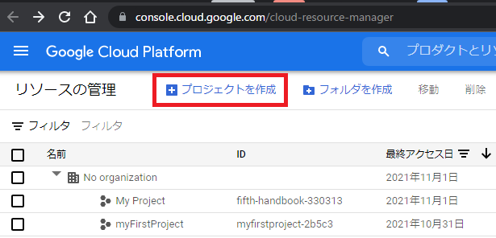

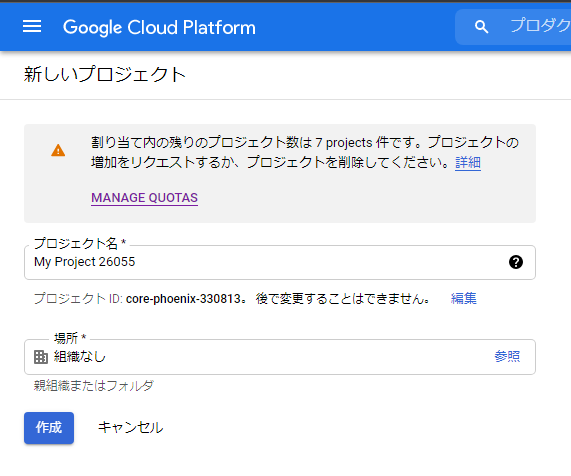


### googlefit apiを有効にする

https://console.cloud.google.com/apis

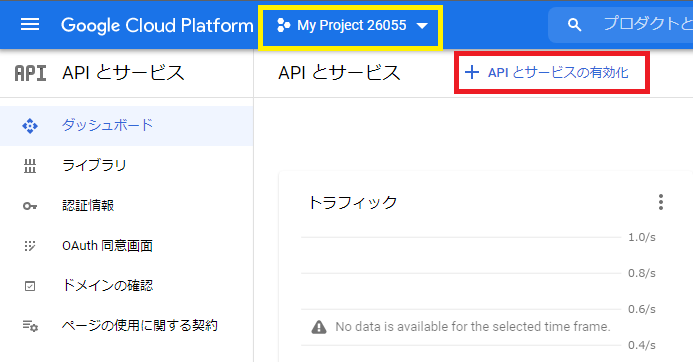

Fitness APIをクリックして有効化

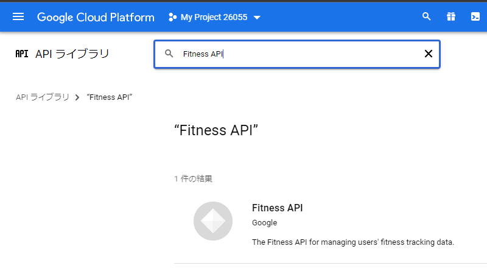

`APIとサービスの有効化` から'Fitness API'を検索して有効化する

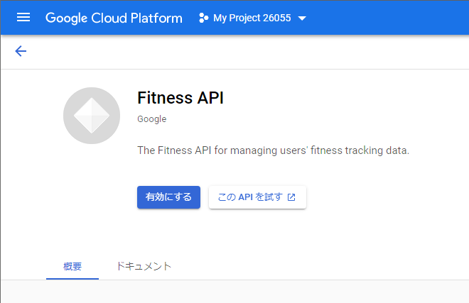

### OAuth 同意画面を設定する

https://console.cloud.google.com/apis/credentials/consent

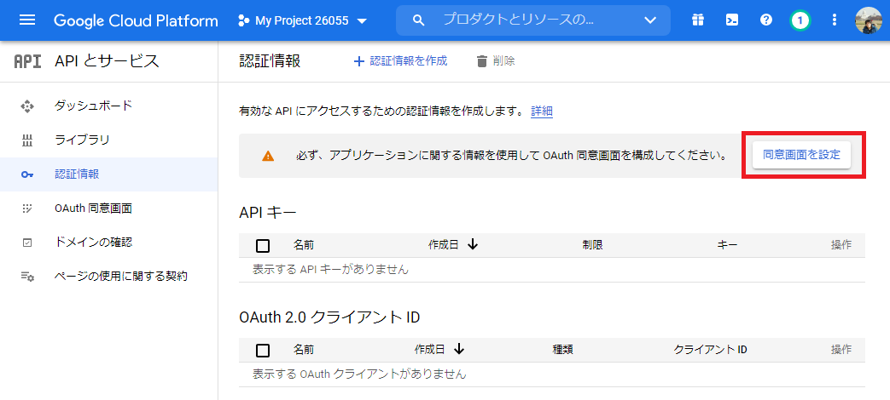

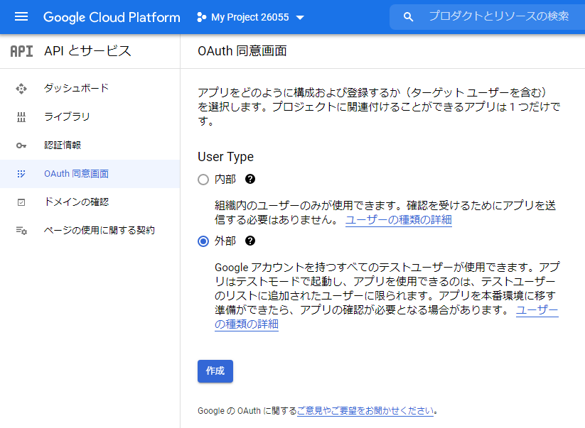

必須の下記3項目を入力して次へ
アプリ名、ユーザーサポートメール、デベロッパーの連絡先情報(メールアドレス)

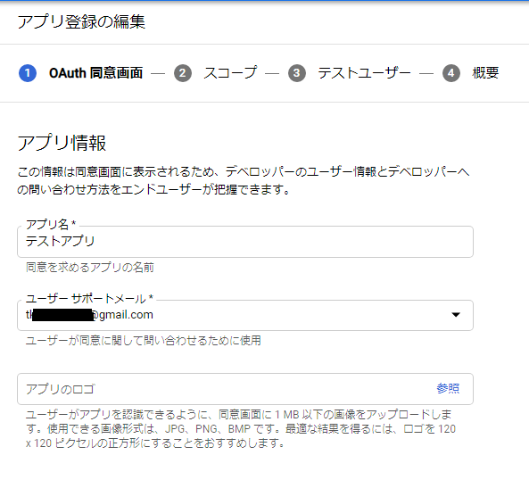

`スコープを追加または削除`をクリック
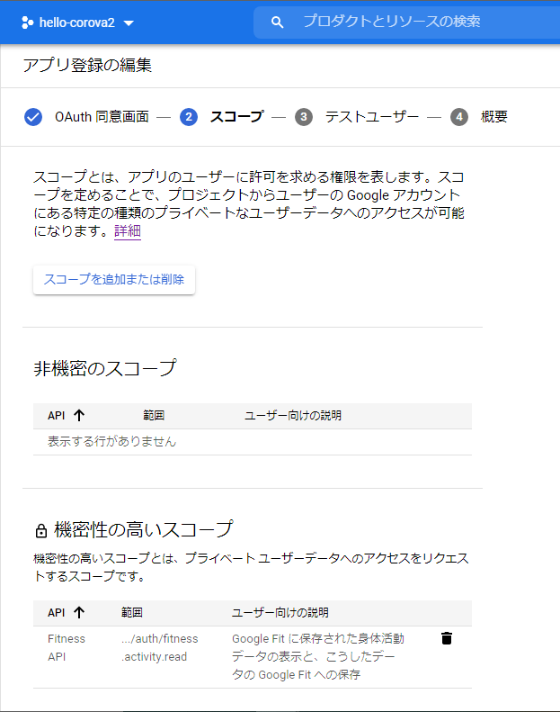

歩数の取得に必要なスコープ(`fitness.activity.read`)を追加

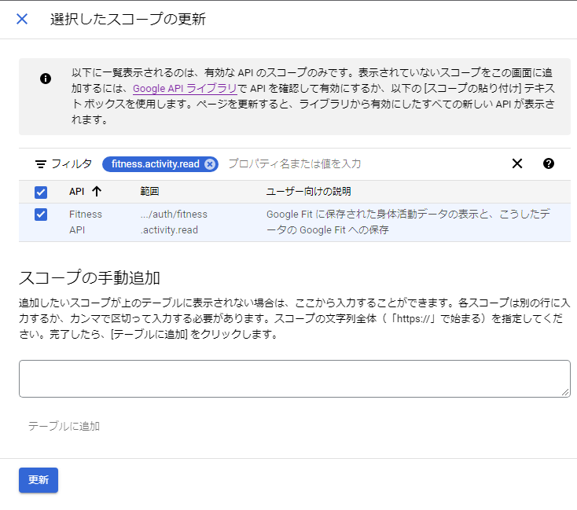

テストユーザに自分を追加

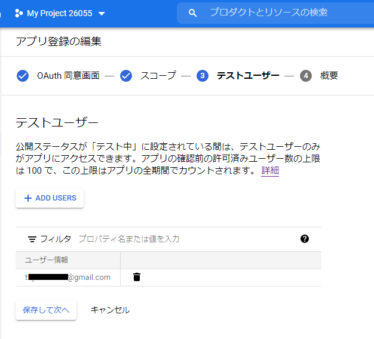

### 認証情報を作成

https://console.cloud.google.com/apis/credentials

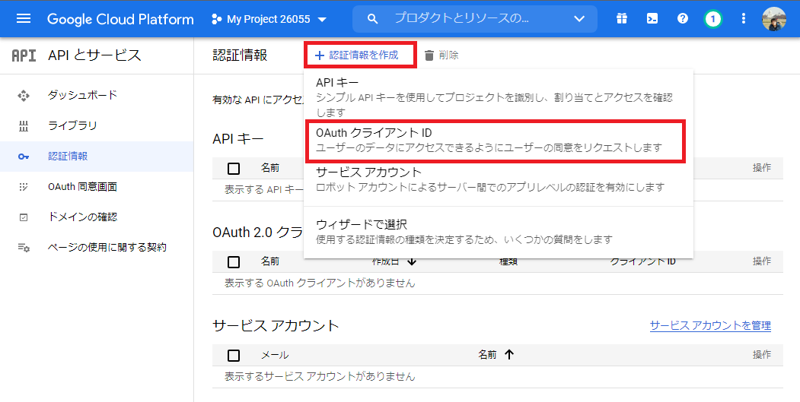

`OAuth 2.0 クライアント ID`にAndoroid用のクライアントIDと、ウェブアプリケーション用のIDの2つを追加する。
画面上部`認証情報の作成`⇒`OAuthクライアントID`を選択。

*  cordovaのアプリはネイティブアプリのため`Andoroid用のクライアントID` のみの設定で問題ないと思ったが、API利用の認証を得るために、ウェブアプリケーション用のIDも必要なようです。

* ①Andoroid用のクライアントID作成

  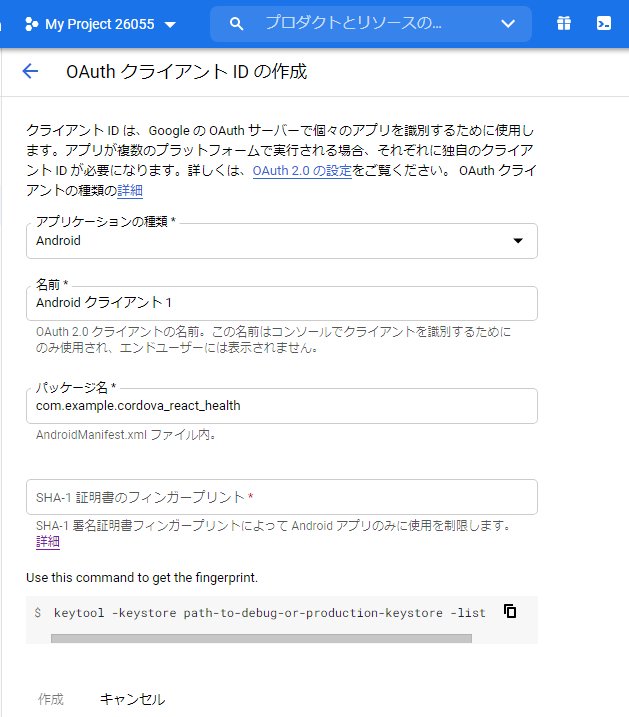

|  アプリケーション種類  |  android  |
| ---- | ---- |
|  パッケージ名  |  config.xml の widget の idから |
|  SHA-1のフィンガープリント  |  下記(SHA1のフィンガープリントを指定する)  |


JDKのbinフォルダにPATHが通っていない場合は、カレントをbinに移動してから下記を実行する
```
keytool -list -v -keystore "%USERPROFILE%\.android\debug.keystore" -alias androiddebugkey -storepass android -keypass android

別名: androiddebugkey
作成日: 2021/10/16
エントリ・タイプ: PrivateKeyEntry
証明書チェーンの長さ: 1
証明書[1]:
所有者: C=US, O=Android, CN=Android Debug
発行者: C=US, O=Android, CN=Android Debug
シリアル番号: 1
有効期間の開始日: Sat Oct 16 14:53:13 JST 2021 終了日: Mon Oct 09 14:53:13 JST 2051
証明書のフィンガプリント:
         MD5:  XX:XX:XX:XX:XX:XX:XX:XX:XX:XX:XX:XX:XX:XX:XX:XX
         SHA1: XX:XX:XX:XX:XX:XX:XX:XX:XX:XX:XX:XX:XX:XX:XX:XX:XX:XX:XX:XX
         SHA256: XX:XX:XX:XX:XX:XX:XX:XX:XX:XX:XX:XX:XX:XX:XX:XX:XX:XX:XX:XX:XX:XX:XX:XX:XX:XX:XX:XX:XX:XX:XX:XX
署名アルゴリズム名: SHA1withRSA
サブジェクト公開鍵アルゴリズム: 2048ビットRSA鍵
バージョン: 1
```

* ②ウェブアプリケーションのクライアントID

  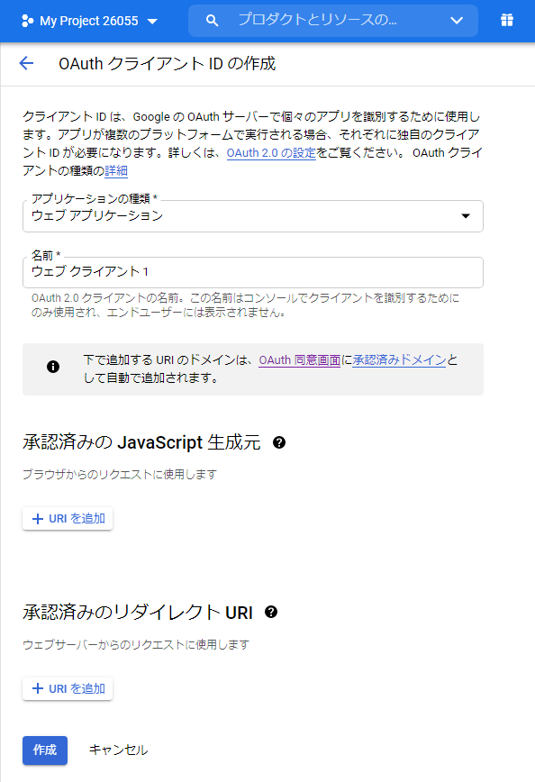

|  アプリケーション種類  |  ウェブアプリケーション  |
| ---- | ---- |
|  承認済みの JavaScript 生成元  |  設定不要 |
|  承認済みのリダイレクト URI  |  設定不要  |


* クライアントID追加後

  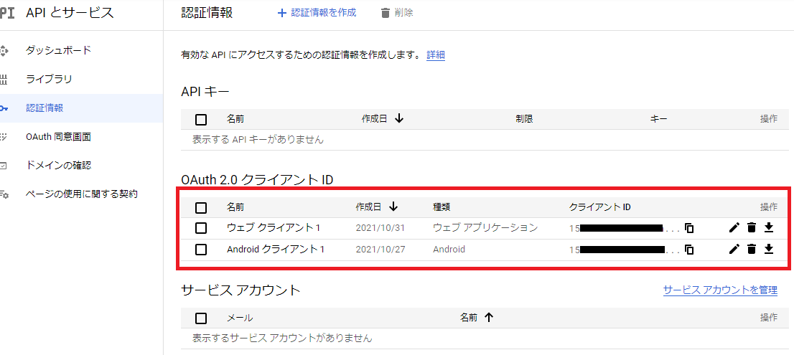


## おまけ

`Error: No Java files found which extend CordovaActivity.`
というエラーが発生した場合、下記のコマンドを実行してplatformを入れなおす。

```
cordova platform rm android
cordova platform add android
```
  * config.xml を変更した場合に起きるようです。
